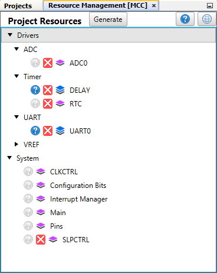
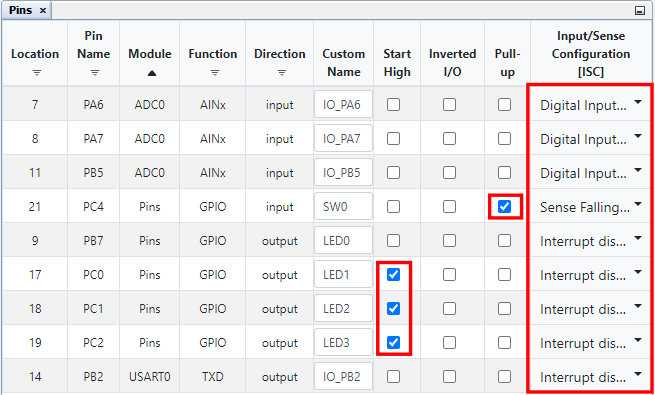
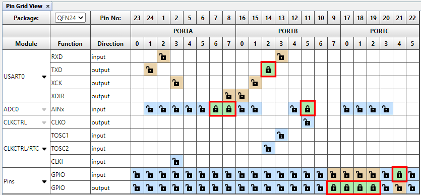
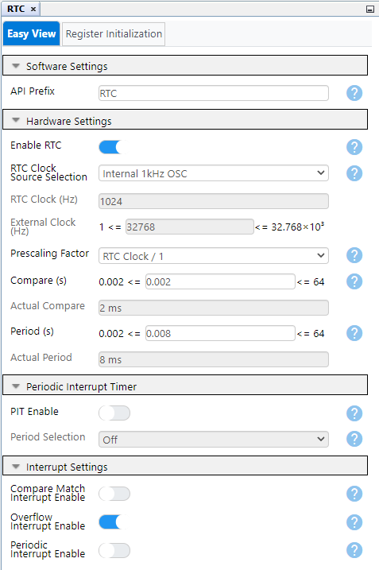
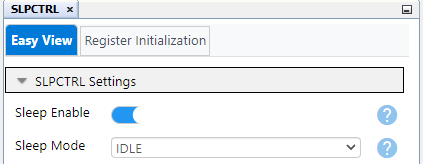

<!-- Please do not change this logo with link -->

# AN???? - Current Measurement and Battery Monitoring With AVR® Devices

This application note shows how to use the ADC featured in the tinyAVR® 2 devices, to measure current and to monitor battery charge. The underlying theory is discussed and a demo application is presented. The demo shows an implementation of a simple circuit where various nodes are connected to the ADC, so that measurements can be taken. Furthermore, by using MPLAB® Data Visualizer the relevant data can be presented live. 

The example in this application note does not include an actual battery, and the circuit can be changed to match the users needs without changing the underlying concepts regarding the functionality of the example.

## Related Documentation

- [AN???? - Using Matrix Keypad With AVR® Devices](https://microchip.com/DS00003407)
- [ATtiny1627 device page](https://www.microchip.com/en-us/product/ATTINY1627)

## Software Used

- MPLAB® X IDE **6.0.0** or newer [(MPLAB® X IDE)](https://www.microchip.com/en-us/tools-resources/develop/mplab-x-ide)
- MPLAB® XC8 **2.40.0** or newer compiler [(MPLAB® XC8)](https://www.microchip.com/en-us/tools-resources/develop/mplab-xc-compilers)
- MPLAB® Code Configurator (MCC) **5.1.17** or newer [(MPLAB® MCC)](https://www.microchip.com/en-us/tools-resources/configure/mplab-code-configurator)
- MPLAB® Data Visualizer **1.3.1160** or newer [(MPLAB® Data Visualizer)](https://www.microchip.com/en-us/tools-resources/debug/mplab-data-visualizer)
- MPLAB® Melody Core **2.2.37** or newer
- tinyAVR® **3.0.151** or newer Device Family Pack

## Hardware Used

- [Microchip ATtiny1627 Curiosity Nano Evaluation Kit](https://www.microchip.com/en-us/development-tool/DM080104)
- Three LEDs
- Five resistors
- Wires
- Micro-USB cable (Type-A/Micro-B)

## Peripheral Configuration using MCC
### Added Peripherals

### Pin manager

### Real-Time Counter (RTC)

### Sleep Controller

## Setup

- Connect the two shunt resistors, R1 and R2, in series between the voltage source and VTG.
- Connect a wire from between the voltage source and R1, to PB5.
- Connect a wire from between R1 and R2, to PA6.
- Connect a wire from between R2 and VTG, to PA7.
- Connecting the load:
  - Connect D1 and R3 in series between PC0 and the node between R1 and R2.
  - Connect D2 and R4 in series between PC1 and the node between R1 and R2.
  - Connect D3 and R5 in series between PC2 and the node between R1 and R2.

## Operation

- Connect the ATtiny1627 Curiosity Nano to a computer using the USB cable.
- Download the zip file or clone the example to get the source code.
- Open the .X file with MPLAB® X IDE.
- Set the *attiny1627-current-measurement-and-battery-monitoring-mplab-mcc* project as main project. Right click on the project in the *Projects* tab and click *Set as Main Project*.
- Program the project to the board: right click the project and click *Make and Program Device*.
- Open MPLAB® Data Visualizer from within MPLAB® X IDE.
- Load the .dvws configuration file *plot_config*.
- Start streaming data by clicking the play button.
- By pressing the button on the curiosity nano the LEDs light up one by one each time the button is pressed, resetting if pressed when all three are lit. The change in currents and voltages can be observed in the graphs in MPLAB® Data Visualizer.

## Summary

This example has shown how to perform simple current measurement and battery monitoring using the ADC featured in tinyAVR® 2 microcontrollers.
